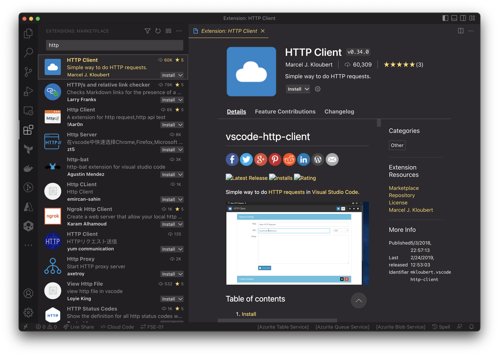

== VSCode and API

We use vscode, free app to execute the API calls for the Avi Controller, to create or delete a task.

=== VSCode plugin used

=== Reference Avi Network 
link:https://avinetworks.com/docs/21.1/api-guide/macro.html[API Macro]

link:https://avinetworks.com/docs/21.1/api-guide/overview.html[Overview Headers full reference]

.VMware - Avi  Required Headers
[%header,cols="5,1,20,1"]

|====
| Name | Mandatory | Description | Usage
| Content-Type | *YES* | Content format. Should be application/json | Content-Type: application/json
| X-Avi-Version |*YES* |  API version to use for the API call. Avi controller supports all the API version which is less than equal to the version of the Controller. In order to use a feature that is released in a version, eg. 17.2.7, the API version should be greater than or equal to 17.2.7. It is important to remember that API version determines the version of the API data. As best practice, users once users have performed integration with a controller and API version then they should keep using it till they tested integration with the new API Version. | X-Avi-Version: 18.1.2
| X-Avi-Tenant | NO | Tenant context. If not present, default tenant for user is used | X-Avi-Tenant: acme
|Authorization |*YES*| Encoded Auth credentials in Base64 or authenticated sessionid cookie is mandatory| Authorization: Basic yjfsdnj984498
|X-CSRFToken | *YES*|  CSRF Token for POST/PUT. Use from csrftoken cookie | X-CSRFToken: hdsbf84r34FFI39nvd398
|Referer |*Yes NB: Mandatory for POST only*|Parent Page|Referer: http://10.10.10.10/
|Accept-Encoding|*Yes NB: Mandatory for GET only*|Requested content format. Should be application/json|Accept-Encoding: application/json
|====

=== ENV File
The env file is allowing us to store password, and other variables we will use in our http code. This will allow us to show our codes without showing the sensitive data. Furthermore, you can have multiple location, just use diff variable names to achieve that. The example has that already.